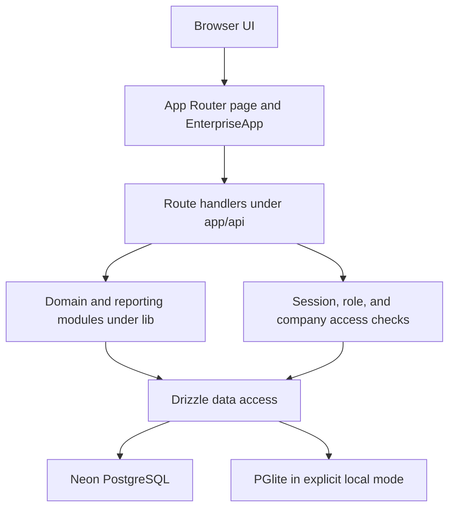

# ComNet Enterprise Accounting

ComNet Enterprise Accounting is a multi-company accounting and inventory application for UAE-oriented operations. It combines sales, purchasing, banking, inventory, VAT, warranty, employee, document, and reporting workflows in one role-controlled Next.js application.

This README is the entry point for the codebase. The focused documents under [`docs/`](docs/) are the canonical reference for architecture, endpoints, features, workflows, and source ownership.

## What the application does

- Manages separate companies and inventory locations with per-user company assignments.
- Supports customers, vendors, employees, items, chart of accounts, exchange rates, VAT codes, and payment terms.
- Creates sales estimates, quotations, proforma invoices, sales orders, invoices, receipts, credit memos, payments, statements, delivery notes, and packing lists.
- Creates purchase orders, item receipts, received-item bills, bills, expenses, vendor credits, bill payments, and UAE bank cheques.
- Posts balanced journal entries, payment allocations, inventory movements, VAT activity, contact balances, and audit history.
- Tracks serial numbers, item specifications, HS codes, country of origin, dimensions, warehouse quantities, reordering, stock pricing, stock counts, transfers, and revaluations.
- Provides 120 reports across Profit & Loss, Financial, Budgets, Accountant, Lists, Employees & HR, Banking, VAT, Customers, Sales, Vendors, Purchases, and Inventory.
- Exports report data to A4 PDF, XLSX, and CSV, supports A4 printing, saved report views, summaries, drill-down, and movable document stamps.
- Supports branded login pages, company document templates, A4 letterheads, light/dark appearance, and six accent themes.

## Technology

| Layer | Implementation |
| --- | --- |
| Web application | Next.js 16 App Router, React 19, TypeScript 5.9 |
| UI | Tailwind CSS 4, Base UI/shadcn components, Lucide icons, Recharts |
| Database | PostgreSQL, Drizzle ORM, Neon serverless driver |
| Local database | PGlite with persistent files under `.local-data/` |
| Documents | jsPDF, jsPDF AutoTable, ExcelJS, browser print layouts |
| Email | Nodemailer with encrypted SMTP credentials |
| Deployment | Vercel, gated by GitHub Actions and CodeQL |

## Architecture at a glance



The root server page resolves the session and renders the login screen, required password change, or the client application shell. `app/enterprise-app.tsx` owns navigation and most cross-module state. Route handlers validate identity, permission, and company scope before calling Drizzle and domain helpers. Inventory-sensitive writes are serialized with SKU reservations and database locks; related writes use database transactions.

See [Architecture](docs/ARCHITECTURE.md) for the runtime, data model, security boundaries, and directory structure.

## Main application workflow

1. A user signs in with email and password. A successful login creates a hashed, HttpOnly, Secure, SameSite session cookie valid for 12 hours.
2. The server checks whether the user must change a temporary password, then loads the application with the user’s role and assigned companies.
3. The user selects a company and optionally an inventory location. These selections scope lists, entry forms, reports, numbering, currency, and stock.
4. A business document is prepared from master data and line items. Server validation checks role permissions, company ownership, VAT, exchange rate, document totals, source allocations, and stock rules.
5. Posting writes the document and dependent rows. Posting documents also update journals, payment allocations, inventory movements, balances, and audit data as applicable.
6. Reports read the resulting ledger, transaction, contact, inventory, VAT, and audit data. Users can filter, inspect summaries, drill into source areas, print, or export.

See [Application workflows](docs/WORKFLOWS.md) for sales, purchasing, inventory, VAT, reporting, administration, and deployment flows.

## API overview

The application exposes 34 route groups under `app/api`. They are internal JSON endpoints used by the application UI rather than a versioned public API.

| Area | Routes |
| --- | --- |
| Identity and administration | `/api/auth/session`, `/api/admin-users`, `/api/admin-settings`, `/api/user-preferences`, `/api/email-settings` |
| Company configuration | `/api/workspaces`, `/api/company-setup`, `/api/company-setup/branding`, `/api/company-setup/letterhead`, `/api/company-setup/clear`, `/api/login-branding` |
| Core records and accounting | `/api/records`, `/api/journal-entries`, `/api/account-history`, `/api/payment-terms`, `/api/attachments` |
| Inventory | `/api/inventory-overview`, `/api/out-of-stock`, `/api/serial-search`, `/api/item-logistics`, `/api/inventory-check-reports`, `/api/stock-pricing`, `/api/stock-revaluation`, `/api/transfers`, `/api/shared-items`, `/api/sku-locks`, `/api/spec-options` |
| Documents | `/api/packing-lists`, `/api/warranty-slips` |
| Tax, currency, and reports | `/api/reports`, `/api/memorised-reports`, `/api/vat-management`, `/api/vat-codes`, `/api/exchange-rates` |

See [API reference](docs/API.md) for methods, authorization, parameters, and behavior for every route group.

## Roles and access

| Role | Typical access |
| --- | --- |
| `all_admin` | Global administration and all companies; represented as Administrator in the client |
| `admin` | Full application access for assigned companies |
| `accountant` | Sales, purchases, banking, journals, accounts, VAT, customer/vendor areas, and reports |
| `sales` | Sales, customer payments, customers, warranties, and read-only inventory context |
| `purchasing` | Purchases, vendors, cheques, and read-only inventory context |
| `inventory` | Inventory maintenance, logistics, counts, and transfers |
| `viewer` | Dashboard, inventory views, serial search, stock checks, and reports |

API access is based on named permissions and is always narrowed by company assignment, except for `all_admin`. Mutating endpoints require a same-origin request. See [Architecture: Security model](docs/ARCHITECTURE.md#security-model).

## Getting started

### Prerequisites

- Node.js 22.13 or newer
- npm
- A PostgreSQL/Neon connection for shared development, or PGlite for isolated local development

### Install

```bash
npm ci
cp .env.example .env.local
```

For a Neon-backed environment, set `DATABASE_URL` in `.env.local`, then run:

```bash
npm run db:migrate
npm run db:seed
npm run dev
```

To initialize the first global administrator, also set `ADMIN_EMAIL` and a 12–128 character `ADMIN_PASSWORD`, then run:

```bash
node scripts/bootstrap-admin.mjs
```

The bootstrap refuses to create another global administrator when an active one already exists.

### Isolated local mode

Run the PGlite development launcher directly:

```bash
node scripts/dev-local.mjs
```

It applies migrations, creates a local global administrator on first run, stores credentials in `.local-data/login.json`, and starts Next.js on `http://localhost:3000`. Override the directory with `COMNET_LOCAL_DATA_DIR` or the port with `PORT`.

## Environment variables

| Variable | Required | Purpose |
| --- | --- | --- |
| `DATABASE_URL` | Production/shared development | PostgreSQL connection used by the application and migration scripts |
| `DATABASE_URL_UNPOOLED` | Migration generation only | Preferred direct URL for Drizzle Kit when available |
| `NEXT_PUBLIC_APP_URL` | Recommended | Canonical application URL and invitation login link |
| `SMTP_ENCRYPTION_KEY` | Recommended for email | At least 32 random characters used to encrypt stored SMTP passwords; database URL is a fallback |
| `ADMIN_EMAIL` | Bootstrap only | Initial global administrator email |
| `ADMIN_PASSWORD` | Bootstrap only | Initial 12–128 character temporary password |
| `COMNET_LOCAL_DB` | Local launcher sets it | Enables PGlite only in development |
| `COMNET_LOCAL_DATA_DIR` | Optional | PGlite and local credential directory; defaults to `.local-data` |
| `PORT` | Optional | Local launcher port; defaults to `3000` |
| `CI_GITHUB_TOKEN` or `GITHUB_TOKEN` | Optional deploy gate | Lets a Vercel build inspect GitHub Actions for a private repository |

## Commands

| Command | Purpose |
| --- | --- |
| `npm run dev` | Start Next.js development mode using the configured database |
| `node scripts/dev-local.mjs` | Start isolated local development with PGlite |
| `npm run lint` | Lint the complete source with zero warnings allowed |
| `npm test` | Run the release-gate, security, transaction, pricing, currency, report, and document tests |
| `npm run typecheck` | Run strict TypeScript checks without emitting files |
| `npm run build:ci` | Build without production migration or deployment gating |
| `npm run ci` | Run lint, tests, type checking, and the CI build |
| `npm run db:generate` | Generate a Drizzle migration from schema changes |
| `npm run db:migrate` | Apply pending SQL migrations from `drizzle/` |
| `npm run db:seed` | Seed the default company, inventory, and 14 standard accounts |
| `npm run build` | Production path: verify CI, apply migrations, and build Next.js |
| `npm start` | Serve a completed Next.js build |

## Database changes

`db/schema.ts` is the typed schema. Generated SQL migrations live in `drizzle/` and are applied in filename order. The shared migration runner records completed files in `__comnet_migrations`. Generate and inspect a migration whenever the schema changes; do not edit production data shape only in TypeScript.

## Quality and deployment

GitHub Actions runs on every push, pull request to `main`, a weekly schedule, and manual dispatch. The two required jobs are:

- **Full source validation:** locked install, lint, tests, type check, and `build:ci`.
- **CodeQL security analysis:** JavaScript/TypeScript `security-extended` analysis, with findings blocking release.

Vercel installs with `npm ci --ignore-scripts` and runs `npm run build`. The production build verifies that both required jobs succeeded for the exact commit, applies pending migrations, and then builds the application. See [CI/CD](docs/ci-cd.md) for operational details.

## Documentation map

| Document | Use it for |
| --- | --- |
| [Documentation index](docs/README.md) | Canonical versus historical documentation and update rules |
| [Architecture](docs/ARCHITECTURE.md) | Runtime layers, security, data model, transaction design, and deployment |
| [API reference](docs/API.md) | All endpoint groups, methods, permissions, and important inputs |
| [Features](docs/FEATURES.md) | Complete product capability map and role visibility |
| [Application workflows](docs/WORKFLOWS.md) | Sign-in, posting, sales, purchasing, inventory, reports, and release flows |
| [Codebase map](docs/CODEBASE-MAP.md) | Source ownership, change locations, conventions, and maintenance checklist |

When behavior changes, update the affected focused document in the same change. `README.md` and the six files above are the maintained source of truth; audit files in `docs/` describe reviews at a point in time.
