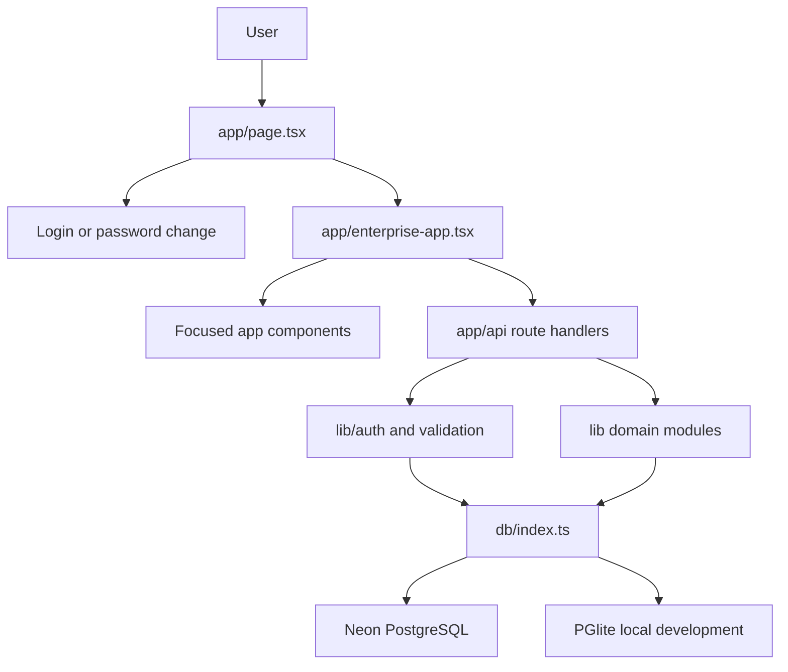
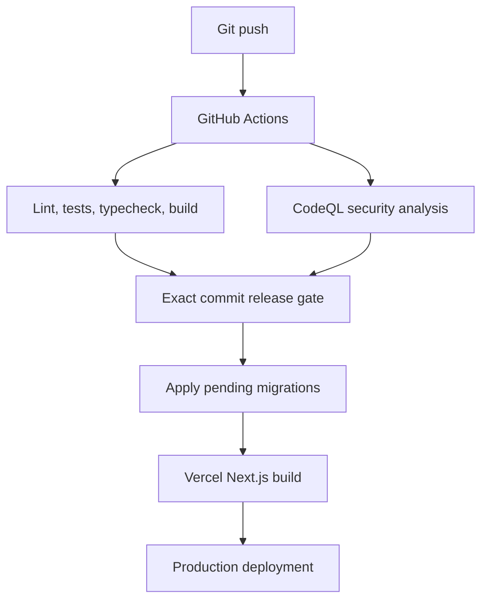

# Architecture

## System shape

ComNet Enterprise Accounting is a full-stack Next.js 16 App Router application. The browser renders a single operational workspace while server route handlers provide the internal JSON API. PostgreSQL is the system of record. Domain calculations, export builders, access checks, and validation live in shared TypeScript modules.

## Runtime layers

### Server entry and application shell

- `app/layout.tsx` provides the root HTML layout and global styling.
- `app/page.tsx` is dynamic because output depends on the session cookie. It chooses among `LoginScreen`, `PasswordChangeScreen`, and `EnterpriseApp`.
- `app/enterprise-app.tsx` is the main client shell. It owns the selected view, company, inventory location, data loading, dialogs, transaction forms, document previews, report navigation, and role-visible sidebar.
- Focused components in `app/*.tsx` implement stock pricing, transfers, warranty, VAT, journals, report layouts, document templates, attachments, and other large surfaces.
- Reusable primitives in `components/ui/` provide the common design system.

### Internal API

Route handlers under `app/api/**/route.ts` return JSON or attachment bytes. They are called by the application UI and are not exposed as a stable, versioned third-party contract.

A typical handler performs these steps:

1. Resolve the session from the `comnet_session` cookie.
2. Reject password-change-required sessions.
3. Enforce a named permission or administrator role.
4. For writes, enforce same-origin requests.
5. Validate `companyId` against the user’s company assignments.
6. Validate request values and referenced company/location records.
7. Execute reads or a transactional write.
8. Return JSON with `Cache-Control: no-store` where current financial data must not be cached.

See [API reference](API.md).

### Domain modules

`lib/` contains code that can be reused by routes and UI components:

- Authentication, access, validation, errors, rate limiting, and encrypted SMTP settings.
- Invoice pricing, payment terms, contact currency, account linking, and standard accounts.
- Profit & Loss, financial, customer, vendor, employee, sales, purchasing, inventory, banking, accountant, list, and budget report transforms.
- PDF, spreadsheet, CSV, printing, letterhead, document design, and UAE cheque layout helpers.
- SKU reservations, item specifications, stock pricing, attachments, and warranty status.

Modules under `lib/` should remain deterministic where possible. Database reads and writes belong in route handlers or narrowly scoped server-only helpers.

### UI design system and responsive contract

- Tailwind CSS 4 tokens in `app/globals.css` define the shared light/dark surfaces, user accent colors, typography, focus treatment, density, responsive breakpoints, and reduced-motion behavior.
- Source-owned shadcn primitives in `components/ui/` are the default controls for buttons, inputs, selects, cards, dialogs, tables, sheets, menus, and other reusable interactions.
- `EnterpriseApp` composes the shared responsive shell: a collapsible desktop sidebar, mobile sheet navigation, sticky page header, company and inventory context, and a constrained content workspace.
- Existing feature screens inherit the shared design system instead of carrying independent page themes. Focused screen styles remain appropriate for domain-specific tables, forms, reports, and document previews.
- Screen-only presentation rules are isolated with `@media screen`; A4 reports, sales documents, letterheads, packing lists, and UAE cheque geometry remain controlled by their dedicated print rules.
- Responsive behavior targets phone, tablet, laptop, and wide desktop layouts. Tables remain horizontally inspectable where the business columns cannot safely collapse, while forms and action groups reflow to one column on small screens.

## Database architecture

### Connection modes

`db/index.ts` selects the data adapter:

- **Normal mode:** Neon HTTP with Drizzle for regular reads.
- **Write transaction:** a single-connection Neon pool with a serializable Drizzle transaction.
- **Local development:** PGlite when `NODE_ENV=development` and `COMNET_LOCAL_DB=1`.

`AsyncLocalStorage` carries the active transaction so nested helpers that call `getDb()` remain on the same connection and transaction. A non-success HTTP response from work inside `withWriteTransaction` triggers rollback as well as a thrown error.

### Data domains

The current Drizzle schema contains 32 tables.

| Domain | Tables |
| --- | --- |
| Company and configuration | `companies`, `company_settings`, `inventory_locations`, `vat_codes`, `exchange_rates`, `email_settings` |
| Identity | `app_users`, `auth_sessions` plus the migration-managed `app_user_companies` assignment table |
| Master data | `contacts`, `items`, `specification_options`, `accounts` |
| Transactions | `transactions`, `transaction_lines`, `invoice_payment_allocations`, `bill_payment_allocations`, `purchase_receipt_allocations`, `sales_invoice_allocations` |
| Inventory | `inventory_movements`, `stock_transfers`, `inventory_check_reports`, `inventory_check_lines`, `sku_work_locks` |
| Accounting and tax | `journal_entries`, `journal_lines`, `vat_adjustments`, `vat_returns`, `audit_log` |
| Documents and reports | `packing_lists`, `packing_list_lines`, `warranty_slips`, `memorised_reports` |

Four infrastructure tables are created by migrations and accessed with parameterized SQL rather than mapped in `db/schema.ts`: `app_user_companies`, `auth_rate_limits`, `idempotency_requests`, and `record_attachments`.

`db/schema.ts` is the typed schema definition. SQL migrations are stored in `drizzle/` and applied in sorted filename order. `scripts/migrate.mjs` records applied filenames in `__comnet_migrations`. The local PGlite launcher wraps each migration file in a transaction; the shared migration runner executes its statement breakpoints sequentially and records the migration after all statements succeed.

### Posting model

`transactions` and `transaction_lines` represent customer, vendor, and banking documents. Source and allocation fields preserve links between estimates/orders and invoices, purchase orders and receipts, invoices and customer payments, and bills and vendor payments.

Posting documents can produce:

- A balanced `journal_entries` header with `journal_lines` debit and credit rows.
- `inventory_movements` for stock additions, reductions, reversals, or transfers.
- Allocation rows for partial receipts, partial invoicing, and multi-document payments.
- Updated contact and document balances/statuses.
- `audit_log` records for sensitive changes.

Non-posting documents such as quotations, estimates, proforma invoices, sales orders, purchase orders, and cheque orders retain workflow data without affecting the ledger until converted or posted.

## Security model

### Sessions

- Passwords use scrypt with a random salt.
- Session tokens contain 32 random bytes. Only a SHA-256 digest is stored in `auth_sessions`.
- The cookie is `HttpOnly`, `Secure`, `SameSite=Strict`, scoped to `/`, and expires after 12 hours.
- Five consecutive failed attempts lock the user for 15 minutes.
- Changing a password revokes every active session for that user.
- Temporary-password users cannot call protected APIs until they change the password.

### Roles and permissions

Server roles are `all_admin`, `admin`, `accountant`, `sales`, `purchasing`, `inventory`, and `viewer`. Named permissions are:

- `workspace:read`
- `inventory:read`
- `inventory:manage`
- `inventory:transfer`
- `reports:read`
- `sales:write`
- `purchases:write`
- `banking:write`
- `accounting:manage`
- `customers:manage`
- `vendors:manage`

`all_admin` can access every company. Every other role is restricted to rows in `app_user_companies`. The client hides unavailable views for usability, while the route handlers enforce permissions and company access as the security boundary.

Employee/HR reports require Administrator access. Global user administration distinguishes the single global `all_admin` capability from company-scoped `admin` users.

### Request and browser controls

- Mutating API calls require a matching request origin.
- Data queries validate that the requested company and inventory location belong together.
- Security headers deny framing, disable MIME sniffing, restrict referrers and browser permissions, and constrain CSP frame ancestors, base URI, and form actions.
- Stored SMTP passwords are encrypted; `SMTP_ENCRYPTION_KEY` is the preferred secret.
- Attachments validate entity type, company access, edit permission, file metadata, and configured size constraints.

## Concurrency and consistency

Inventory writes use `lib/sku-locks.ts`:

1. The server resolves affected SKUs and locations from server-owned records, including source documents and both transfer sides.
2. PostgreSQL advisory transaction locks reject overlapping saves.
3. Short-lived rows in `sku_work_locks` coordinate active browser forms for 120 seconds.
4. The write runs in one database transaction and releases reservations when appropriate.

The same wrapper is used by core records, pricing, revaluation, logistics, transfers, and inventory count reports. Important edits also use expected values or source allocation checks to detect stale forms. Posting logic validates stock availability and allows protected administrator override only where the company setting permits it.

## Reporting and documents

`/api/reports` dispatches report keys into specialized modules or common data sets. Company home currency is authoritative for general accounting reports. Vendor reports may accept a transaction currency, while UAE VAT reports remain company-wide instead of inventory-location scoped.

Report output is normalized as a title, description, generation time, currency, columns, rows, optional summary, chart metadata, period metadata, and drill-down context. The client renders the same model and exports it through `lib/report-export.ts` to PDF, XLSX, or CSV.

Document output combines company setup, selected template, logos, letterhead, bank details, line data, and optional draggable stamps. Print CSS and PDF generation target A4 output.

## Deployment architecture

Vercel runs `npm run build`. `scripts/require-ci.mjs` verifies both named GitHub jobs for the exact commit and branch before `scripts/migrate.mjs` and `next build` run. If a linked private repository cannot be read through the anonymous GitHub API and no token is configured, the gate runs the local lint, test, and type-check suite before allowing the build.

## Architectural constraints

- Treat API routes as the server trust boundary. UI validation alone is insufficient.
- Preserve company and location filters on every tenant-owned read and write.
- Keep related accounting and inventory writes in `withWriteTransaction`.
- Use the SKU write wrapper for a workflow that can change an item, quantity, price, cost, or location relationship.
- Preserve source/allocation links when converting or partially fulfilling documents.
- Add a migration when persisted structure changes.
- Update the canonical documentation listed in [`docs/README.md`](README.md) with behavior changes.
