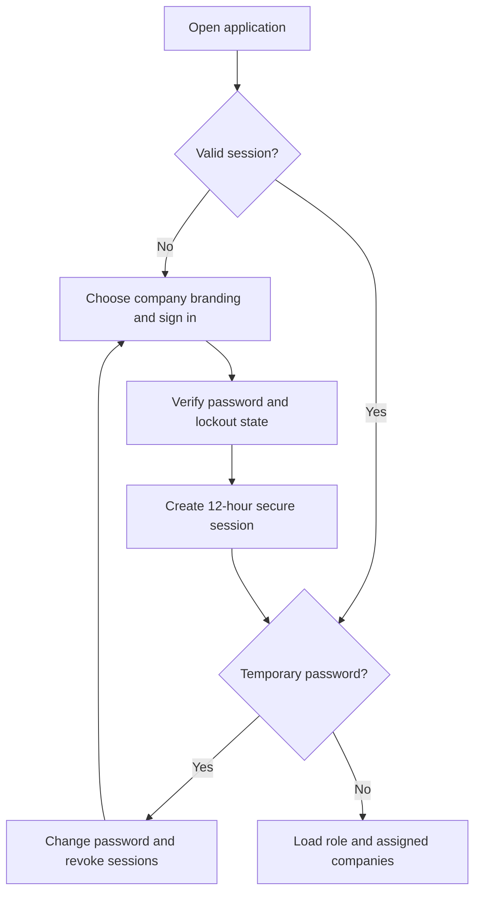
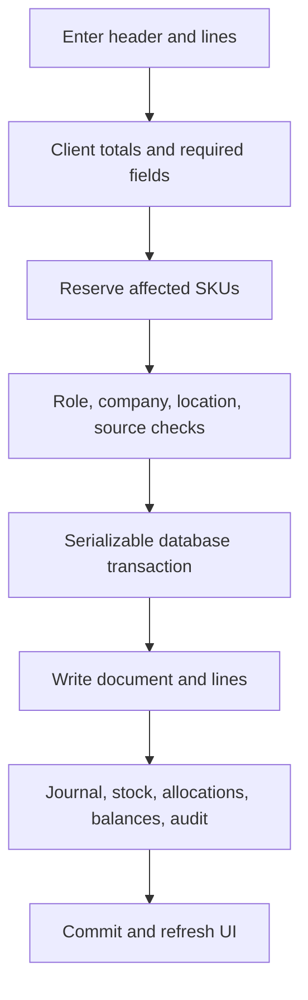
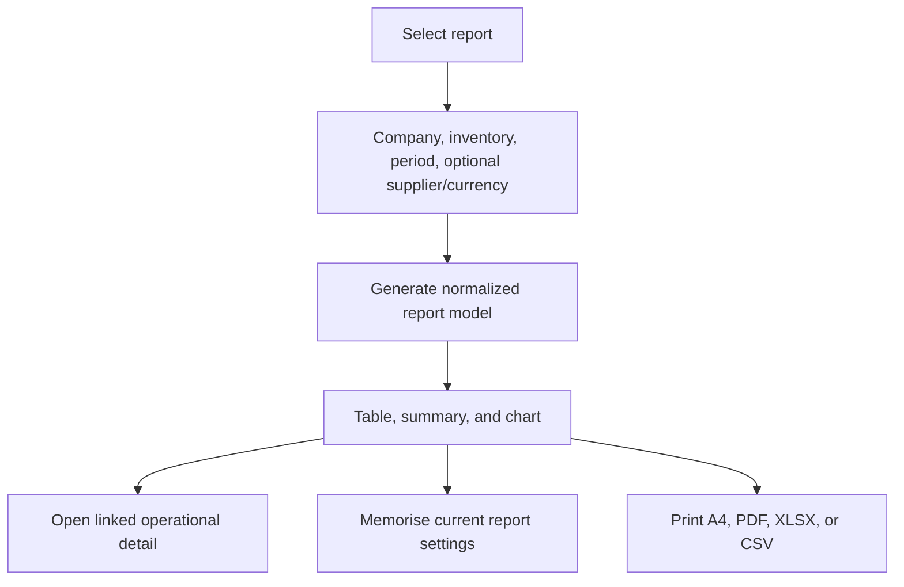

# Application workflows

## 1. Authentication and workspace entry

1. The public login screen loads safe branding, optionally for a selected company.
2. `/api/auth/session` verifies the active user and scrypt password. Five failed attempts produce a 15-minute lock.
3. Successful login records time, source IP, and user agent, then issues the session cookie.
4. A temporary-password account is sent to the password-change screen. Changing it revokes every session, requiring a new login.
5. The server loads the application shell with role, company assignments, name, avatar, accent theme, and appearance mode.
6. The user selects a company and inventory location. All subsequent operational calls send those identifiers, and the API verifies them again.

## 2. Master-data workflow

Customers, vendors, employees, items, and accounts use `/api/records`.

1. The client loads the selected record kind for the company and optional inventory.
2. The user creates or edits a record in the relevant center.
3. The server selects the write permission from the record kind and transaction type.
4. Company/location ownership and field rules are validated. Examples include international customer phone formats, 15-digit TRNs, vendor requirements, item types, unique SKU/item numbers, and account hierarchy rules.
5. Related records are created where required, such as currency-specific AR/AP control accounts.
6. The response refreshes the active list. Sensitive vendor changes are retained in the audit log.

## 3. Common transaction posting workflow

Posting documents share these invariants:

- The server recomputes and validates amounts instead of trusting display totals.
- Transaction currency uses a valid exchange rate and accounting effects are stored in home currency.
- Debit and credit journal lines must balance.
- Referenced contacts, items, accounts, inventories, and source documents must belong to the company.
- Stock-affecting documents reserve SKUs, lock rows, and reject stale/overlapping work.
- Negative stock is blocked unless the protected company override flow is valid.
- A failed dependent write or non-success response rolls back the transaction.

When an existing posting document is edited, the server reverses its prior ledger, stock, allocations, and balance effects before applying the replacement. Destructive deletion is Administrator-only and master data with dependent activity is protected.

## 4. Sales workflow

### Quote/order to invoice

1. Create an estimate, quotation, proforma invoice, or sales order for a customer. Estimates, proforma invoices, and sales orders default the posting-account dropdown to that customer’s linked Accounts Receivable account in the document currency; invoices use the same default.
2. These source documents remain non-posting.
3. Open Sales Documents lists source lines with quantity still available to invoice.
4. Choose a source, destination inventory, and partial or full quantities.
5. Save an invoice. `sales_invoice_allocations` records each invoiced source line quantity.
6. The source status becomes partially invoiced or completed as allocations accumulate.
7. The invoice posts revenue, receivable, VAT, cost of goods sold, and stock reduction as its lines require.

### Direct sale and credit

- An invoice posts receivable and remains open until payments cover it.
- A sales receipt posts a completed sale and receipt together.
- A credit memo reverses the applicable sales and inventory effects.
- Statement and finance charges post customer balance and revenue effects without normal stock lines.

### Customer payment

1. Select company, inventory, customer, and transaction currency.
2. The UI loads open invoices and remaining balances.
3. Allocate one payment across one or several invoices.
4. Saving creates the payment, `invoice_payment_allocations`, cash/receivable journal effect, customer balance update, and invoice status refresh.

### Sales document output

Open a saved transaction to choose its supported output: tax/commercial invoice, proforma, delivery note, packing list, or HS-code summary. Company design, logos, letterhead, bank details, VAT data, serials, line comments, attachments, and optional stamps feed the A4 print/PDF view. The output selector defaults documents to portrait and lets the user switch to landscape.

## 5. Purchasing workflow

### Purchase order receiving

1. Create a non-posting purchase order for a vendor.
   Selecting the vendor fills the posting account from its linked Accounts Payable account in the order currency; changing the order currency refreshes that selection. If a legacy vendor has no account in that currency, the form creates or restores the currency control account before saving and links it to the vendor when appropriate.
2. Open Purchase Orders shows quantities not yet received.
3. Select an order, receiving inventory, and partial/full line quantities.
4. Save an item receipt or received-item bill.
5. `purchase_receipt_allocations` records quantities against each order line.
6. Inventory is increased; a bill also posts payable, inventory/expense, and input VAT effects.
7. The purchase order becomes partially received or received based on cumulative allocations.

### Bills and vendor payments

1. Enter a bill or expense in the vendor currency and inventory context. Bills default the posting-account dropdown to the selected vendor’s linked Accounts Payable account in that currency; purchase orders use the same vendor-currency default.
2. The posting creates payable/expense or inventory/VAT journal effects and stock additions where relevant. Stock received through Enter Bill appears in Inventory Overview → New Arrival for 12 hours from saving, regardless of the bill’s business date. View opens the original bill in its company/inventory context. Editing the bill preserves its original creation timestamp; cancelling or deleting it removes it from subsequent overview loads.
3. The unpaid-bills view calculates remaining balance from direct and multi-bill allocations.
4. A bill payment or supplier cheque can allocate one payment to multiple bills through `bill_payment_allocations`.
5. Saving updates the vendor balance and each bill’s payment status.

### Purchase return

1. Select a vendor, inventory, currency, and original bill.
2. The server calculates purchased quantity less earlier returns.
3. Create a vendor credit for an allowed quantity.
4. Posting reduces stock and payable/expense effects and links the return to its source bill.

## 6. Inventory workflows

### Item maintenance

1. Create a stock or supported non-stock/service item in an inventory location.
2. Maintain sale price, unit/GRN cost, reorder point, specification values, serial details, and status.
3. Logistics maintenance adds HS code, origin, dimensions, and weight.
4. Shared Items can compare/copy a matching SKU across companies the user can access.

### Transfer

1. Select source company/inventory and one or more items.
2. Select a destination inventory for every line and enter quantities.
3. The server verifies access to both sides, resolves source/destination SKU locks, and checks stock.
4. A transaction moves quantity out of the source and into the destination while retaining transfer history.
5. Administrator edit/delete paths revise or reverse the prior movements.

### Inventory check

1. Choose a company/inventory and select currently stocked items.
2. Save a count report with system quantity and actual quantity.
3. The report retains line snapshots and can compare the same item across accessible companies.
4. Administrator update/delete paths use SKU locks to avoid conflicting quantity work.

### Pricing and revaluation

- Stock Pricing loads current sale/GRN prices. Batch save includes expected old values and returns `409` when another update won the race.
- Stock Revaluation calculates valuation inputs and posts protected cost changes.
- The Out of Stock view filters the consolidated inventory data by selected company/location and reorder state.

## 7. Banking, journal, VAT, and cheque workflows

### Banking

Deposits, cheques, credit-card charges, account transfers, cheque orders, and opening balances use the common transaction flow. The server selects the correct system/control accounts and creates balanced journals.

### General journal

1. Select company, inventory, date, reference, currency, and exchange rate.
2. Add debit and credit lines against chart accounts.
3. The server requires a balanced entry and valid accounts.
4. Posted entries feed the ledger and financial reports. Authorized edits/deletions update the ledger consistently.

### UAE cheque

1. Choose supplier, salary, or expense purpose and a configured bank layout.
2. Enter payee, amount, date, account, memo, and optional bill allocations.
3. Save to post the banking/payable/expense effect.
4. Print through the bank-specific positioning controls, including date and crossing alignment.

### VAT

1. VAT codes drive transaction line tax calculations.
2. The VAT center loads a company-wide period, independent of selected inventory.
3. Accounting users review output/input tax, reverse charge, exceptions, and unassigned activity.
4. Authorized users add adjustments and record VAT return/filing data.
5. VAT reports and the Report Center read the same posted transaction and journal sources.

## 8. Warranty and packing workflows

### Warranty/RMA

1. Choose a customer or invoice and load eligible invoice items.
2. Record item, serial, issue, received date, supplier, warranty dates, condition, and service status.
3. Save/update the slip and print the A4 service record.

### Packing list

1. Open a sales invoice and load its lines.
2. Create a packing list number/date and edit carton references, quantities, weights, dimensions, and serials.
3. Save the packing list linked to invoice and invoice lines.
4. Print the A4 packing document through the selected company design. Packing lists default to landscape, with portrait available from the output selector.

## 9. Reporting workflow

The UI groups and searches 120 report definitions. `/api/reports` validates report-specific access and filters, loads ledger/transaction/master data, and returns normalized columns and rows plus optional summary/chart/period metadata. The client can drill into linked areas, save a user/company report view, choose A4 portrait or landscape (portrait by default), and export the same result.

## 10. Administration workflow

- **Companies and inventories:** create/edit workspace records, bank/company metadata, currency, invoice series, and locations.
- **Users:** create users, assign roles and companies, reset temporary passwords, activate/deactivate accounts, and send invitation email when configured.
- **Branding:** configure login visuals, logos, company document template/color, letterhead, and stamp.
- **SMTP:** save encrypted mail settings and send a test message.
- **Company clear:** protected Administrator action for clearing selected operational data while retaining required setup.

## 11. Development and release workflow

1. Install the exact lockfile with `npm ci`.
2. Develop against configured PostgreSQL with `npm run dev`, or isolated PGlite with `node scripts/dev-local.mjs`.
3. Change `db/schema.ts` and generate/review a SQL migration for persistent model changes.
4. Run `npm run ci` before release-sensitive changes.
5. Push the commit. GitHub Actions runs full source validation and CodeQL.
6. Vercel begins the Git-linked build and waits for both required jobs for the exact SHA.
7. The production build applies pending migrations, builds Next.js, and deploys only after the release gate succeeds.
